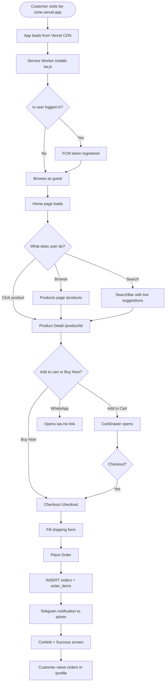
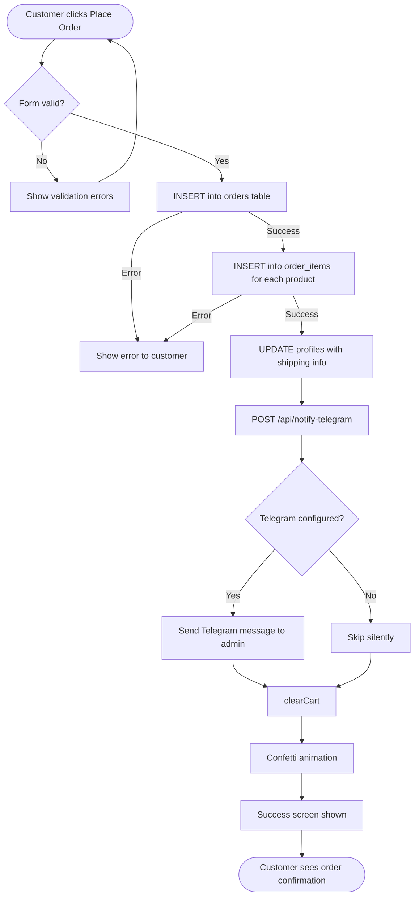
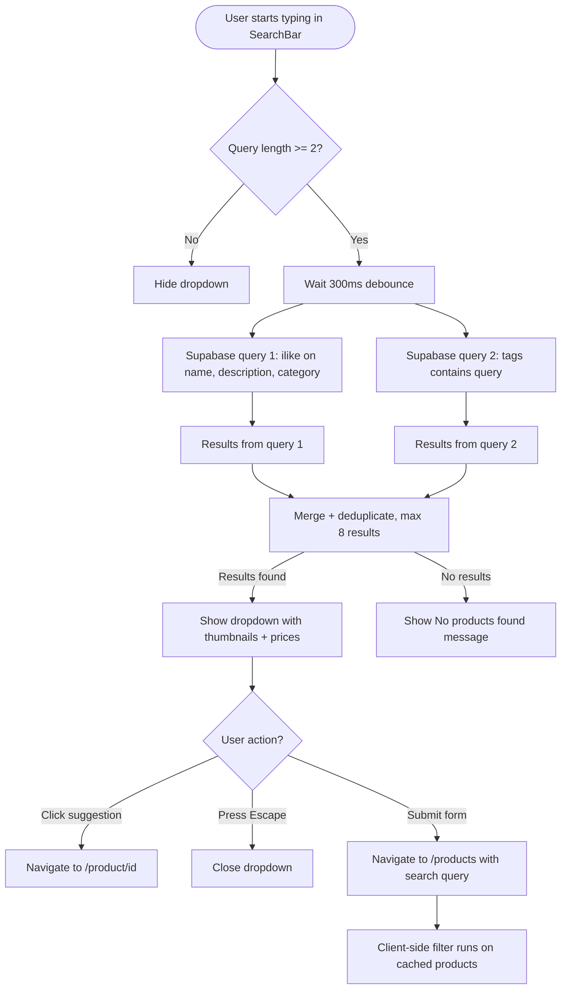
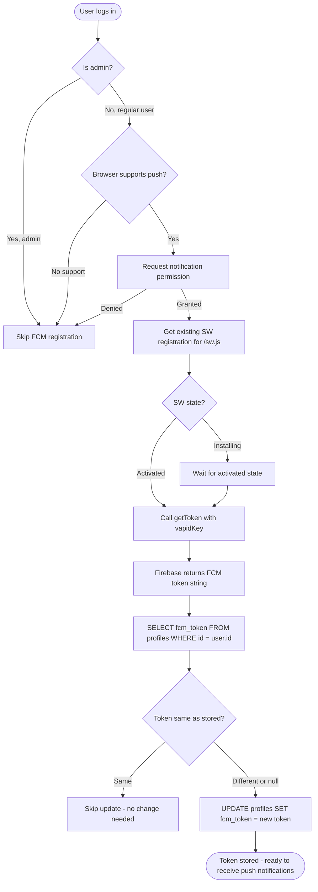
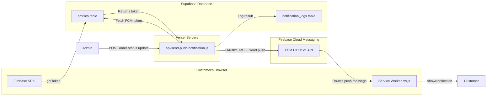
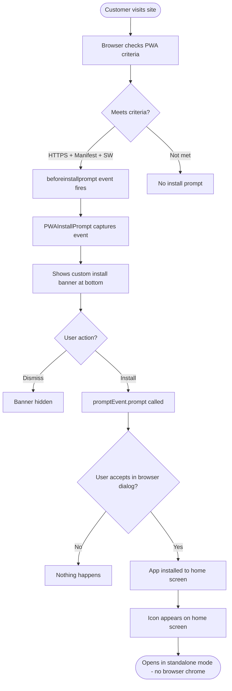
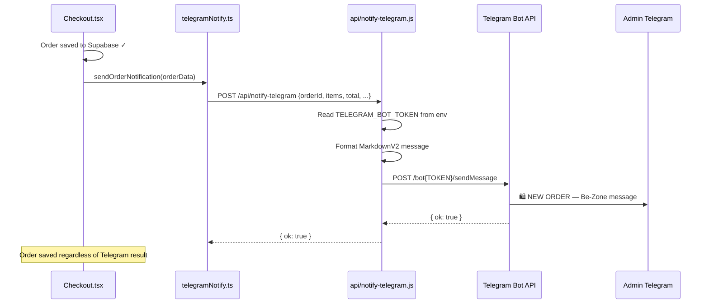

# 17 — Flowcharts (Mermaid Diagrams)

All diagrams below are written in **Mermaid** syntax. They render automatically on GitHub, Notion, and most documentation platforms. Paste any block into [mermaid.live](https://mermaid.live) to see it visually.

---

## 1. Complete User Journey



---

## 2. Authentication Flow

```mermaid
flowchart TD
    A([User visits /auth]) --> B{Sign In or Sign Up?}
    
    B -->|Sign Up| C[Enter name, email, password]
    C --> D[supabase.auth.signUp]
    D --> E[Supabase creates auth.users row]
    E --> F[DB trigger fires: INSERT into profiles]
    F --> G[Session starts automatically]
    
    B -->|Sign In| H[Enter email, password]
    H --> I[supabase.auth.signInWithPassword]
    I -->|Wrong credentials| J[Error toast shown]
    J --> H
    I -->|Success| G
    
    G --> K[AuthContext updates user + session]
    K --> L[checkAdmin RPC call]
    L -->|Admin| M[isAdmin = true]
    L -->|Not admin| N[isAdmin = false]
    M --> O[/admin accessible]
    N --> P[useFCMToken registers push token]
    P --> Q[Token saved to profiles.fcm_token]
```

---

## 3. Order Placement Flow



---

## 4. Admin Order Management + Push Notification Flow

```mermaid
flowchart TD
    A([Admin opens /admin]) --> B{isAdmin?}
    B -->|No| C[Redirect to /]
    B -->|Yes| D[Load all orders from Supabase]
    D --> E[Admin selects order]
    E --> F[Admin changes status dropdown]
    F --> G[UPDATE orders SET status = new value]
    G --> H[Admin clicks Send Notification]
    H --> I[POST /api/send-push-notification]
    I --> J[Fetch profiles.fcm_token for user]
    J -->|No token| K[Log no_token to notification_logs]
    J -->|Has token| L[Mint Google OAuth2 access token from service account]
    L --> M[POST to Firebase FCM HTTP v1 API]
    M -->|Success| N[Log sent to notification_logs]
    M -->|UNREGISTERED| O[Clear stale token from profiles]
    O --> P[Log failed to notification_logs]
    M -->|Other error| P
    N --> Q([Customer device receives push notification])
    Q --> R[Customer taps notification]
    R --> S[/profile opens showing updated order]
```

---

## 5. Product Search Flow



---

## 6. FCM Token Registration Flow



---

## 7. Database Entity Relationships

```mermaid
erDiagram
    auth_users {
        uuid id PK
        text email
        text raw_user_meta_data
    }
    
    profiles {
        uuid id PK_FK
        text full_name
        text phone
        text email
        text address
        text city
        text pincode
        text fcm_token
        timestamptz created_at
    }
    
    user_roles {
        uuid id PK
        uuid user_id FK
        app_role role
    }
    
    products {
        uuid id PK
        text name
        text description
        integer price
        integer original_price
        text category
        text image
        numeric rating
        integer review_count
        text[] tags
        text zodiac_sign
        boolean in_stock
    }
    
    orders {
        uuid id PK
        uuid user_id FK
        text status
        text payment_method
        integer total
        text shipping_name
        text shipping_phone
        text shipping_address
        text shipping_city
        timestamptz created_at
    }
    
    order_items {
        uuid id PK
        uuid order_id FK
        uuid product_id FK
        text product_name
        integer price
        integer quantity
    }
    
    reviews {
        uuid id PK
        uuid product_id FK
        uuid user_id FK
        text author
        integer rating
        text comment
    }
    
    campaigns {
        uuid id PK
        text title
        text coupon_code
        boolean is_active
    }
    
    notification_logs {
        uuid id PK
        uuid order_id FK
        uuid user_id
        text status
        text error_message
        timestamptz created_at
    }
    
    auth_users ||--|| profiles : "has profile"
    auth_users ||--o{ user_roles : "has roles"
    auth_users ||--o{ orders : "places"
    orders ||--o{ order_items : "contains"
    products ||--o{ order_items : "ordered as"
    products ||--o{ reviews : "has"
    orders ||--o{ notification_logs : "triggers"
```

---

## 8. Push Notification Architecture



---

## 9. PWA Installation Flow



---

## 10. Telegram Bot Flow


